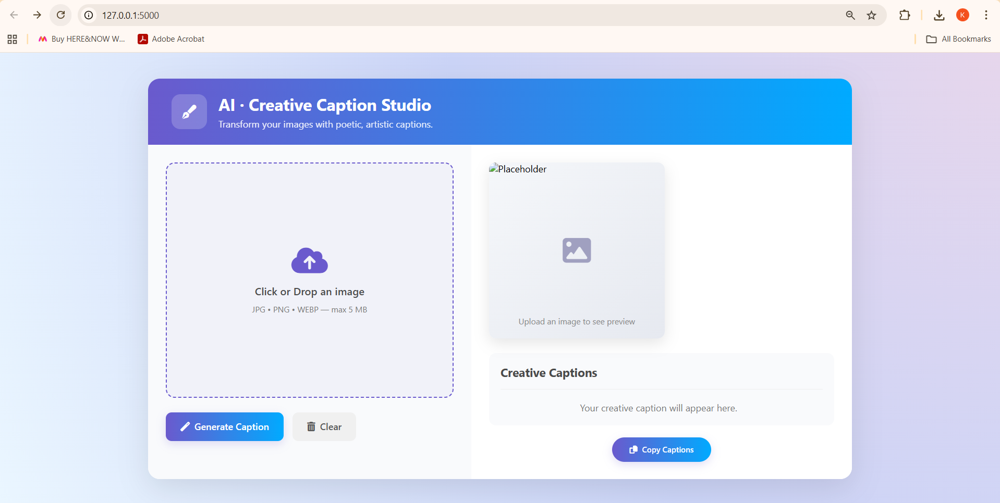
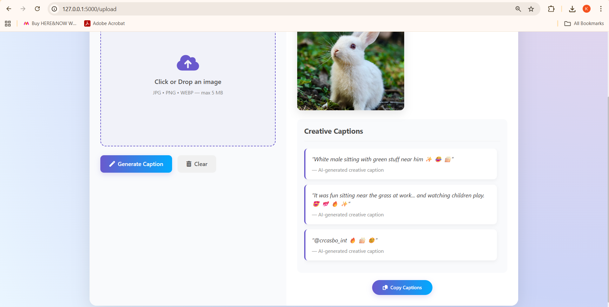

# 🖼️ CODSOFT Internship -- Task: Image Captioning System

This project is created as part of my **CODSOFT AI Internship**.  
It is an **AI-powered Image Captioning System** built using  
**Flask, PyTorch (BLIP + FLAN-T5), TensorFlow (ResNet50 + LSTM), and Keras**.

---

## 🚀 Features

-   📤 Upload an image (JPG, PNG, WEBP) through web UI
-   🤖 **AI Captioning**:
    -   BLIP model → generates base description  
    -   FLAN-T5 → rewrites into fun, creative Instagram-style captions with emojis & hashtags
-   📝 Get **multiple caption variations** for each image
-   🎨 Modern and responsive UI with preview & copy-to-clipboard option
-   ⚡ Option to train your own model on datasets like **Flickr8k**

---

## 🛠️ Tech Stack

-   **Backend:** Flask (Python)  
-   **Frontend:** HTML, CSS, JavaScript  
-   **Deep Learning Models:**
    -   BLIP (image → text description)  
    -   FLAN-T5 (creative caption generation)  
    -   ResNet50 + LSTM (custom training on Flickr8k dataset)  
-   **Libraries:**  
    -   PyTorch, Hugging Face Transformers  
    -   TensorFlow / Keras  
    -   Pillow, NumPy, TQDM  

---

## 📂 Project Structure

Task2_ImageCaptioning/
│
├── app.py # Flask backend (BLIP + FLAN-T5)
├── preprocess.py # Text preprocessing & sequence preparation
├── train.py # Custom model training (ResNet50 + LSTM)
├── requirements.txt # Dependencies
├── static/
│ ├── style.css # CSS styling
│ └── placeholder.png # Default placeholder image
├── templates/
│ └── index.html # Web UI
├── data/ # (Optional) Dataset files (Flickr8k images/text)
└── README.md # Project documentation

markdown
Copy code

---

## ⚙️ Installation & Setup

1. **Clone this repository**

    ```bash
    git clone https://github.com/kavyaoza/codsoft_task2.git
    cd codsoft_taskno/Task2_ImageCaptioning
    ```

2. **Create a virtual environment (optional)**

    ```bash
    python -m venv venv
    source venv/bin/activate   # Linux/Mac
    venv\Scripts\activate      # Windows
    ```

3. **Install dependencies**

    ```bash
    pip install -r requirements.txt
    ```

4. **Run the Flask app**

    ```bash
    python app.py
    ```

5. **Open in browser**

    ```
    http://127.0.0.1:5000/
    ```

---

## 📊 How It Works

1. **Upload Image** via the frontend.  
2. **BLIP Model** generates a raw description from the image.  
3. **FLAN-T5 Model** rephrases the description into **short, fun, poetic captions** with emojis & hashtags.  
4. **Multiple variations** are returned and displayed in the UI.  
5. Captions can be **copied with one click**.  

For **custom training**:
- ResNet50 extracts image features.  
- Captions are cleaned and tokenized.  
- LSTM Decoder learns to generate captions word-by-word.  
- Trained weights & tokenizer are saved (`caption_model_weights.h5`, `tokenizer.pkl`).  

---
---
## 📸 Screenshots

### 🔹 Home Page (Before Upload)


### 🔹 Uploaded Image With Caption


---

## 🎥 Demo Video
👉 [Watch Demo Video](https://www.linkedin.com)  


## 📦 Requirements

The dependencies for this project are listed in **requirements.txt**:

```txt
Flask==2.2.5
torch==2.0.1
transformers==4.33.2
Pillow==9.5.0
numpy==1.24.3
tqdm==4.65.0
scikit-learn==1.2.2
tensorflow==2.10.0

Install them with:

bash
Copy code
pip install -r requirements.txt
✅ Internship Requirement
Task completed as part of CODSOFT AI/ML Internship

Maintained proper GitHub repository (codsoft_task2)

To be shared on LinkedIn tagging @codsoft

---

## **👨‍💻 Author**

-   Name: *Kavya Oza*\
-   Email: *kavyaoza54@gmail.com*\
-   GitHub: [yourusername](https://github.com/kavyaoza)\

-   LinkedIn: [your-linkedin-profile](https://linkedin.com/in/your-link)
